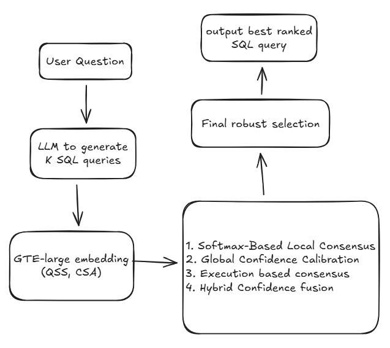

# VeriSQL: Uncertainty-Aware Text2SQL Verification and Reranking

VeriSQL is an uncertainty-aware Text-to-SQL system that extends a simple generation pipeline into a full verification, scoring, and reranking framework.
It reads the Spider dataset (dev.json), builds schema-aware prompts, generates multiple candidate SQL queries using the **deepseek-chat, grok-4-1-fast-non-reasoning** model. Rather than modifying model internals or fine-tuning for accuracy, VeriSQL focuses on **post-generation** reliability, leveraging semantic consensus, probabilistic calibration through Gaussian Mixture Models (GMM), and execution-level validation to select the most trustworthy SQL query.

The system stores all generated candidates, computes detailed uncertainty scores (Softmax, GMM posterior, semantic entropy, execution agreement), and outputs both raw predictions and reranked results. Comprehensive logs are also captured for every run.

## System Architecture

The figure below illustrates the overall architecture of the VeriSQL framework.

<p align="center">  </p>

Given a natural language question and database schema, the system constructs a schema-aware prompt and generates multiple candidate SQL queries using a black-box LLM. These candidates are then passed through a verification stage that computes semantic confidence, probabilistic calibration, and execution-level agreement signals. Finally, a hybrid reranking module integrates these uncertainty signals to enable robust and reliable selection of the final SQL query, mitigating the impact of spurious or inconsistent generation.

## Project layout
- `main.py` – entry point; orchestrates loading data, building prompts, and writing outputs.
- `config/config.json` – default runtime configuration (paths, provider/model, delay, mode, and output targets).
- `src/dataset/loader.py` – helpers to load `dev.json` and `tables.json` and pair questions with schemas.
- `src/prompts/` – prompt builders (currently zero-shot with system/user separation).
- `src/llm/` – LLM router plus provider clients (DeepSeek, Grok, OpenAI).
- `src/generator.py` – runs the generation loop, cleaning outputs and writing JSON.
- `src/utils/` – logging setup and SQL text cleaning helpers.
- `logs/` – log files (created at runtime).
- `outputs/` – generated predictions (created at runtime).

## Prerequisites
- Python 3.10+
- Spider dataset available locally (expects `dev.json` and `tables.json` inside the dataset folder).
- Environment variables for providers (place in a `.env` loaded by your shell):
  - `DEEPSEEK_API_KEY` (DeepSeek)
  - `GROK_API_KEY` (xAI Grok)
  - `OPENAI_API_KEY` (OpenAI ChatGPT)

## Configuration
Defaults configuration live in `config/config.json`:
```json
{
  "dataset_path": "./spider_data/",
  "default_provider": "deepseek",
  "default_model": "deepseek-chat",
  "num_sample": 1,
  "num_query": 1,
  "max_tokens": 2048,
  "request_delay": 0.0,
  "mode": "generate",
  "output_llm": "outputs/llm/deepseek_chat_k=1.json",
  "output_rerank": "outputs/reranked/deepseek_chat_k=1_reranked.json"
}
```
## Notes
- The `num_query` setting controls how many SQL candidates are requested in a single LLM response. The prompt expects the model to return a JSON array with exactly this many `sql` entries.
- The `request_delay` setting helps avoid rate limits when using real APIs.
- `mode` controls whether the CLI runs online generation (`generate`) or offline reranking (`rerank`).
- Can use provider `grok` with the model `grok-4-1-fast-non-reasoning`

You can override any of these via CLI flags.

## Environment Setup (run from repo root)
1. Create and activate a Python virtual environment:
   ```bash
   python -m venv .venv
   source .venv/bin/activate
   ```
2. Install dependencies:
   ```bash
   pip install -r requirements.txt
   ```

## Running
From the repository root, choose a provider/model pair (defaults are DeepSeek/deepseek-chat):
```bash
# DeepSeek (default)
python main.py --mode generate --provider deepseek --model deepseek-chat --dataset_path spider_data/ --num_sample 100 --num_query 1 --max_tokens 6000 --output_llm outputs/llm/deepseek_chat_k=1.json

# Grok
python main.py --mode generate --provider grok --model grok-4-1-fast-non-reasoning --dataset_path spider_data/ --num_sample 100 --num_query 1 --max_tokens 6000 --output_llm outputs/llm/grok-4-1-fast-non-reasoning_k=1.json

# OpenAI ChatGPT
python main.py --mode generate --provider openai --model gpt-5-mini --dataset_path spider_data/ --num_sample 100 --num_query 1 --max_tokens 6000 --output_llm outputs/llm/gpt-5-mini_k=1.json
```

Logs will be written to `logs/run_<timestamp>.log`, with a single file capturing the full session. The generation output contains entries shaped like:
```json
{
  "dataset_path": "spider_data",
  "default_provider": "deepseek",
  "default_model": "deepseek-chat",
  "mode": "generate",
  "num_sample": 1,
  "num_query": 3,
  "max_tokens": 2048,
  "generated": [
    {
        "id": 0,
        "question": "How many singers do we have?",
        "db_id": "concert_singer",
        "candidates": [
        { "sql": "SELECT COUNT(*) FROM singer;" },
        { "sql": "SELECT COUNT(singer_id) FROM singer;" },
        { "sql": "SELECT COUNT(*) FROM (SELECT DISTINCT singer_id FROM singer) t;" }
        ]
      }
    ]
}
```

The zero-shot prompt used for generation is:

```
Given this database schema:
{schema}

Question: {question}

Generate exactly {n} different, correct SQL queries that answer the question.
Each query must use a different SQL approach. Return ONLY a JSON array with {n} objects.

Format: [{"sql": "query1"}, {"sql": "query2"}, ...]
```

### Offline reranking
After collecting LLM outputs, run the semantic consensus reranker:

```bash
python main.py --mode rerank --output_llm outputs/llm/deepseek_chat_k=1.json --output_rerank outputs/reranked/deepseek_chat_k=1_reranked.json
```

The reranker computes cosine similarity, consensus, softmax probabilities, GMM posteriors, semantic entropy, GMM entropy, and three strategies (softmax-only, GMM-only, hybrid). It writes both the specified reranked file and a convenience copy named `reranked_output.json` inside the reranked output directory.

## SQL Extraction

Use `sql_extract.py` to extract all the required sql queries from the output predicted files and store only the sql queries in a separate folder. Later this file will be used for evaluation to report the results. There are 2 modes `simple` means take the first sql query from the candidate and second `sac` is to take the best sql from 3 different techniques softmax, GMM and hybrid.

```bash
python sql_extract.py --input_path outputs/llm/deepseek_chat_k=1.json --output_dir extracted_sql_for_evaluation/ --mode simple
```

and for using the sac mode we have the following prompt
```bash
python sql_extract.py --input_path outputs/reranked/deepseek_chat_k=4_reranked.json --output_dir extracted_sql_for_evaluation/ --mode sac
```

## Evaluation

Use `evaluate.py` to call the official Spider evaluation script and obtain exact match and execution accuracy metrics:

```bash
python install.py
```

```bash
python evaluation.py --gold spider_data/dev_gold.sql --db spider_data/database --table spider_data/tables.json --pred extracted_sql_for_evaluation/deepseek_chat_k=4_reranked_sql_robust.sql --etype all
```

The script will create a temporary `.sql` file, run `spider_data/evaluate.py`, and print the reported metrics.

## Experimental Results

This section reports empirical results for **VeriSQL** under different SQL samples and reranking strategies. Experiments are conducted using black-box LLMs as SQL generators, with uncertainty-aware verification applied post-generation.

Across all experiments:

* k denotes the number of SQL candidates sampled per query.

* **k = 1** serves as the **baseline**, corresponding to standard single-output decoding without reranking.

* For **k > 1**, multiple candidates are generated and filtered using uncertainty-aware selection strategies.

Evaluation is performed on the first 100 queries from the Spider 1.0 `dev.json` file. Performance is reported using Execution Accuracy (EX) and Exact Match (EM).

### Results with deepseek-chat as SQL Generator

The table below reports execution accuracy and exact match scores on **first 100 queries** sampled from the **Spider 1.0 `dev.json` file** using **deepseek-chat** model within the VeriSQL framework.

| **Method (k)**   | **Execution Acc (EX) (%)** | **Exact Match (EM) (%)** |
| ---------------- | --------------------- | ------------------- |
| Baseline (k = 1) | 65                    | 45                  |
| Softmax (k = 4)  | 54                    | 45                  |
| GMM (k = 4)      | 54                    | 45                  |
| Hybrid (k = 4)   | 61                    | 43                  |
| Robust (k = 4)   | 69                    | 46                  |
| Softmax (k = 5)  | 60                    | 48                  |
| GMM (k = 5)      | 60                    | 48                  |
| Hybrid (k = 5)   | 60                    | 48                  |
| Robust (k = 5)   | 60                    | 45                  |
| Softmax (k = 8)  | 61                    | 45                  |
| GMM (k = 8)      | 60                    | 44                  |
| Hybrid (k = 8)   | 59                    | 42                  |
| Robust (k = 8)   | 71                    | 56                  |
| Softmax (k = 12) | 56                    | 38                  |
| GMM (k = 12)     | 54                    | 36                  |
| Hybrid (k = 12)  | 53                    | 34                  |
| Robust (k = 12)  | **72**                | **54**              |
| Softmax (k = 22) | 47                    | 21                  |
| GMM (k = 22)     | 55                    | 31                  |
| Hybrid (k = 22)  | 52                    | 26                  |
| Robust (k = 22)  | 71                    | 54                  |
| Softmax (k = 35) | 46                    | 21                  |
| GMM (k = 35)     | 48                    | 28                  |
| Hybrid (k = 35)  | 45                    | 20                  |
| Robust (k = 35)  | 70                    | 52                  |

The **best-performing** k value for **EX** metric in the above setting is shown in **bold**.

### Results with grok-4-1-fast-non-reasoning as SQL Generator

The table below reports execution accuracy and exact match scores on **first 100 queries** sampled from the **Spider 1.0 `dev.json` file** using **grok-4-1-fast-non-reasoning** model within the VeriSQL framework.

| **Method (k)**   | **Execution Acc (EX) (%)** | **Exact Match (EM) (%)** |
| ---------------- | --------------------- | ------------------- |
| Baseline (k = 1) | 54                    | 32                  |
| Softmax (k = 4)  | 44.4                  | 30.3                |
| GMM (k = 4)      | 44.4                  | 30.3                |
| Hybrid (k = 4)   | 48.5                  | 32.3                |
| Robust (k = 4)   | 58.6                  | 36.4                |
| Softmax (k = 5)  | 40                    | 29                  |
| GMM (k = 5)      | 40                    | 29                  |
| Hybrid (k = 5)   | 40                    | 30                  |
| Robust (k = 5)   | 57                    | 39                  |
| Softmax (k = 8)  | 36                    | 23                  |
| GMM (k = 8)      | 36                    | 23                  |
| Hybrid (k = 8)   | 37                    | 23                  |
| Robust (k = 8)   | 59                    | 38                  |
| Softmax (k = 12) | 35                    | 24                  |
| GMM (k = 12)     | 33                    | 23                  |
| Hybrid (k = 12)  | 38                    | 26                  |
| Robust (k = 12)  | **65**                | **42**              |
| Softmax (k = 22) | 23                    | 18                  |
| GMM (k = 22)     | 23                    | 17                  |
| Hybrid (k = 22)  | 26                    | 18                  |
| Robust (k = 22)  | 57                    | 37                  |
| Softmax (k = 35) | 21                    | 17                  |
| GMM (k = 35)     | 21                    | 17                  |
| Hybrid (k = 35)  | 29                    | 21                  |
| Robust (k = 35)  | 53                    | 38                  |

The **best-performing** k value for **EX** metric in the above setting is shown in **bold**.

## Findings

Experimental results show that **k = 12** yields the strongest overall performance for the VeriSQL framework across both **deepseek-chat** and **grok-4-1-fast-non-reasoning** models. This suggests that moderate candidate diversity is sufficient to enable reliable semantic consensus and execution-based verification without introducing excessive noise.

## Dataset Download

To run this project, you need the **Spider 1.0** dataset, which provides the natural language questions, gold SQL queries, and database files used for evaluation.

### 📦 Download Links

* **Spider 1.0 Dataset (Google Drive):**
  [https://drive.google.com/file/d/1403EGqzIDoHMdQF4c9Bkyl7dZLZ5Wt6J/view](https://drive.google.com/file/d/1403EGqzIDoHMdQF4c9Bkyl7dZLZ5Wt6J/view)

* **Official Spider GitHub Repository:**
  [https://github.com/taoyds/spider](https://github.com/taoyds/spider)

### 🔧 How the Dataset Is Used

* **`dev.json`** — evaluation questions used by your pipeline
* **`tables.json`** — database schema definitions used in prompt construction
* **`database/`** — actual SQLite databases used for execution accuracy

Make sure you set your config properly:

```json
{
  "dataset_path": "./spider_data/"
}
```
